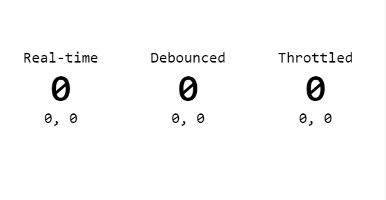

<p align="center">
  <a href="https://codesandbox.io/s/react-debounced-component-9dboeo?file=/src/App.js">
    
  </a>
</p>

<h3 align="center">Wrap components with a <code>debounce</code>, <code>throttle</code>, or any other delayed-rendering method, to stop them from re-rendering often when their props change.</h3>

<br>
<p align="center">
  <a href="https://codesandbox.io/s/react-debounced-component-9dboeo?file=/src/App.js">
    
  </a>
</p>

## Motivation
[`React.memo`](https://reactjs.org/docs/react-api.html#reactmemo) can be used to control whether a certain (wrapped) component should be rendered or not,
by providing it with custom method as the a second paramater, but `memo` is not helpful in all situations.

Sometimes it is wished to limit the number of times a component is rendered, for example, to a specific FPS or just to debounce it, so if it is called often,
with different props, it will only actually re-render once those often calls are ceased (for enough time).

Sometimes components are very "expensive" to to re-render, in terms of performance (intense CPU usage), or they do async operations such as network requests.
Assuming the parent-component which is causing these re-renders (by updating props often) cannot be refactored, or the cause is a deep mystery (due to code complexity),
then wrapping those often-rendered components with `bouncer` HOC should alleviate the symptoms.

<br>

## Install:

Use from [CDN](https://unpkg.com/@yaireo/react-bouncer) / Download from this repo / [NPM](https://www.npmjs.com/package/@yaireo/react-bouncer)

```bash
npm i @yaireo/react-bouncer -S
```

## Usage Examples:

```js
import bouncer from '@yaireo/react-bouncer'

// simplified example for a component which gets rendered often due to props change
const Foo = ({x,y}) => `${x} ${y}`;


// uses 300ms `debounce` by default
const DebouncedFoo = bouncer(Foo)
DebouncedFoo.displayName = 'DebouncedFoo';

// use a `throttle` method instead of the default `debounce` (or use your own custom one)
const ThrottleddFoo = bouncer(Foo, 300, throttle)
DebouncedFoo.displayName = 'ThrottleddFoo';


// use them in another component which might render them often with different props
const App = () => {
  const [pos, setPos] = useState({x:0, y:0})

  // re-render on mouse move
  useEffect(() => {
    const onMouseMove = e => setPos({x: e.pageX, y: e.pageY})
    window.addEventListener('mousemove', onMouseMove)
    return () => window.removeEventListener('mousemove', onMouseMove)
  }, [])

  return <>
      <DebouncedFoo {...pos}/>
      <ThrottleddFoo {...pos}/>
  </>
}
```


